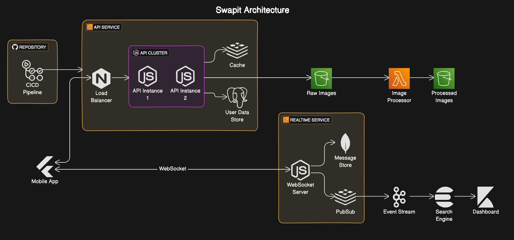

# Swapit API Service

## Project Overview

Swapit is a mobile application designed to facilitate item swapping between users. This repository contains the API service, which is a crucial component of the Swapit backend architecture.



## Repository Links

- [Swapit API Service](https://github.com/aradbm/swapit-api-service) (This repository)
- [Swapit App (Mobile)](https://github.com/aradbm/swapit-app)
- [Real Time Chat Service](https://github.com/aradbm/swapit-chat-service)
- [Message Pipeline](https://github.com/aradbm/swapit-message-pipeline)
- [Image Resizer Lambda](https://github.com/aradbm/image-resizer-lambda)

## Technology Stack

- **Backend Framework**: Node.js with Express
- **Database**: PostgreSQL (User Data Store)
- **Caching**: Redis
- **Authentication**: Firebase
- **Cloud Provider**: AWS (EC2, S3, Lambda)
- **Containerization**: Docker
- **CI/CD**: GitHub Actions

## API Service Architecture

The API Service runs on an AWS EC2 instance and consists of the following components:

- Load Balancer (Nginx)
- API Cluster (Node.js instances)
- User Data Store (PostgreSQL)
- Cache (Redis)

## Key Features

- User authentication and management
- Item listing
- Item swapping functionality (matching)
- Real-time chat integration
- Image processing and storage

## Getting Started

### Prerequisites

- Node.js (v18 or later)
- Docker and Docker Compose
- AWS CLI (for deployment)

### Local Development

1. Clone the repository:

```
git clone https://github.com/aradbm/swapit-api-service.git
cd swapit-api-service
```

2. Install dependencies:

```
npm install
```

3. Set up environment variables:
   Copy `.env.example` to `.env` and fill in the required values.

4. Add environment variables

5. Start the development server:

```
npm run dev
```

### Running with Docker

To run the entire stack:

```
docker-compose up
```

For development:

```
docker-compose -f docker-compose.dev.yml up
```

## Deployment

The project uses GitHub Actions for CI/CD. On push to the main branch:

1. Tests are run
2. If tests pass, the action connects to the EC2 instance via SSH
3. The latest code is pulled and containers are restarted

## Testing

Run the test suite with:

```
npm test
```

## Project Structure

```
swapit-server/
├── src/ # TypeScript source files
│ ├── controllers/ # Request handlers
│ ├── models/ # Database models
│ ├── middleware/ # Custom middleware
│ ├── config/ # Configuration files
│ └── ...
├── Dockerfile # Docker configuration
├── docker-compose.yml # Configuration for all services and databases
├── nginx.conf # Nginx configuration
└── ...
```
